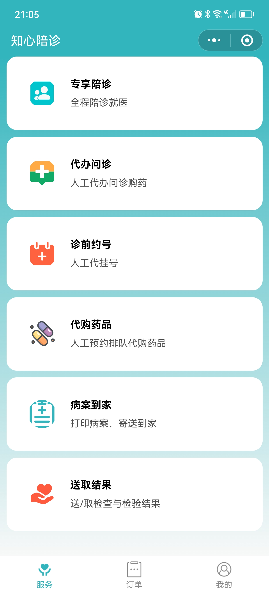
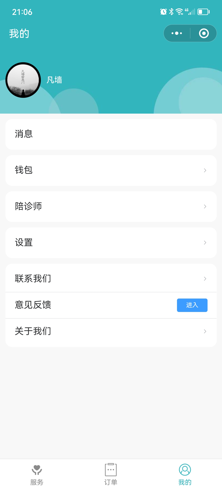

# 知心陪诊系统

#### 介绍
知心陪诊系统是一个基于TP6+VUE的陪诊系统。

#### 使用说明

1. 允许用于个人学习、毕业设计、教学案例、公益事业;
2. 遵循 GPL-3.0 开源协议，可以免费商用，如果商用必须保留版权信息，请自觉遵守。开源版不适合商用，商用请购买商业版;
3. 禁止将本项目的代码和资源进行任何形式的出售，产生的一切后果责任由侵权者自行承担；
4. 严禁使用本系统源码开展非法活动。

#### 项目结构
|-backend  // 后端系统

|-|-apps

|-|-|-base   // 基础服务应用，包括地区管理、短信、公共配置等。

|-|-|-file   // 上传服务应用

|-|-|-health_assist  // 陪诊应用

|-db // 数据库文件

|-|-db_base.sql  // 基础服务应用数据库文件

|-|-db_file.sql  // 上传服务应用数据库文件

|-|-db_health_assist.sql  // 应用数据库文件

|-frontend  // 前端

|-|-base    // 基础服务应用前端

|-|-miniapp  // 小程序端

|-|-mp   // 用户端

|-|-op   // 运营端

|-static   // 静态资源 

#### 运行环境

- Linux | Windows
- MySql 5.7+
- Nginx 1.10+
- PHP >= 7.2.5
- PDO PHP 拓展
- OpenSSL PHP 拓展
- Exif PHP 拓展
- Fileinfo PHP 拓展
- Mbstring PHP 拓展
- SeaLog PHP 拓展
- sphinxforchinese

#### 演示小程序

#### 截图示例

